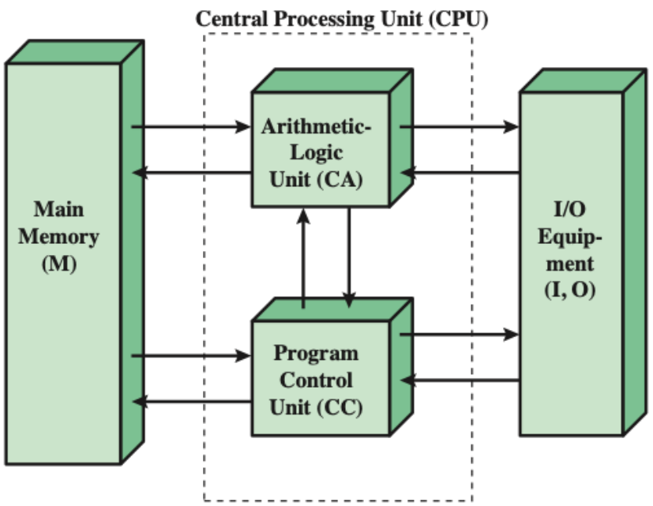

# A Crash Course in Computer Architecture

## 1 - Structure & Function
Computers are amazingly complex systems. Viewing them in a hierarchical way is the easiest way to describe its structure.
For any level, we typically consider it in two aspects: 
1. structure: the way in which components relate to each other
2. function: how these component operate as part of the structure

### 1.1 - Function
There are 4 major functions:
1. Data Processing
2. Data Storage
3. Data Movement
4. Control

### 1.2 - Structure
The basic structure of the computer contains 4 main components:
1. The central processing unit (CPU)
   1. The control unit
   2. Arithmetic and logic unit (ALU)
   3. Registers
   4. CPU interconnection
       

            
       

2. Main memory
3. IO
4. System interconnection

## 2 - The Stored Program Concept
Originally, programming required setting the value of a large number of switches as well as plugging and unplugging
a lot of cables.

Learning from this, stored-program concept was developed.

### 2.1 - Stored-program Concept
The idea was to store programs in memory along with their data. 

To make this work, programs needed to be represented in
binary, allowing the computer to get instructions by reading them from memory. This concept led to the design of the IAS computer.

### 2.2 - The IAS Computer
Almost all general purpose computers are based on the following design:
The main components were:
1._Main memory_ 2._ALU_ 3._A control unit_ 4._IO_

### 2.3 - The IAS Instruction Cycle
This cycle is performed by the computer again & again, where each one has two parts:
1. Fetch: The next instruction and relevant memory address are loaded into the CPU.
2. Execute: The instruction is interpreted and the calculation is completed.

