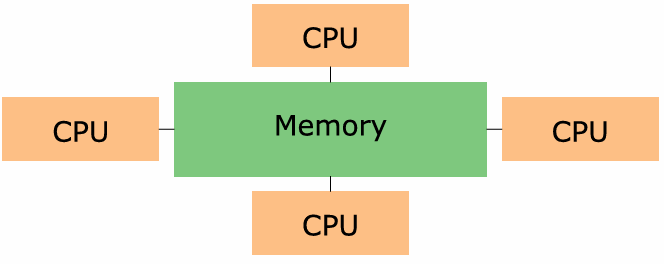
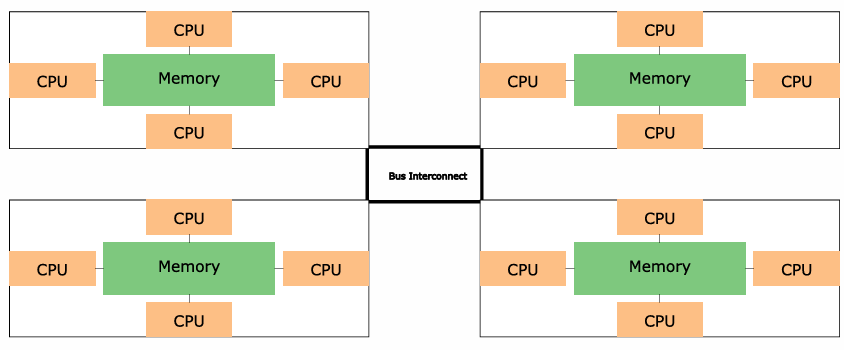
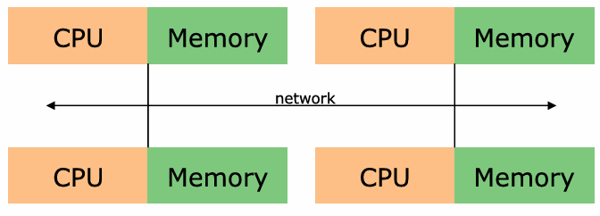
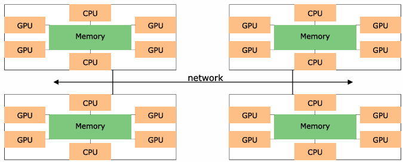

# Parallel Memory Architectures

Only three memory architectures are in parallel computing:
- Shared memory
- Distributed memory
- Hybrid distributed-shared memory

## 1 - Shared Memory
For all processors, they are able to access all memory as a **global address space**.

### 1.1 - Characteristics
Multiple processors can operate independently but share the same memory resources.
When one processor changes a value in a memory location that change is visible to all others processors.

Shared memory machines can be divided into two main classes based upon memory access times:
- Uniform Memory Access (UMA)
- Non-Uniform Memory Access (NUMA)

### 1.2 - Uniform Memory Access
Most commonly represented today by Symmetric Multiprocessor (SMP) machines, where all processors are the same, and
they have equal access to memory and equal access times. Also called Cache Coherent UMA.

#### Cache Coherence
One possible problem with a shared memory system is that caches of blocks in memory may become out of date. This could 
happen if another processor changes a block that we have in our cache. A cache coherent shared memory system has 
hardware that ensure this is not possible.

### 1.3 - Non-Uniform Memory Access
Often made by physically linking two or more SMPs. One SMP can directly access memory of other SMPs. 
Yet, Not all processors have equal access time to all memories.

### 1.4 - Advantages of Shared Memory
- Global address space provides a user-friendly programming perspective to memory. 
- Data sharing between tasks is both fast and uniform due to the proximity of memory to CPUs.

### 1.4 - Disadvantages of Shared Memory
- Lack of scalability between memory and CPUs
- Programmers are responsible for synchronization, which ensures "correct" access of global memory.
- It becomes increasingly difficult and expensive to design and produce shared memory machines with increasing numbers of processors.

## 2 - Distributed Memory
### 2.1 - Characteristics
- The common characteristic for distributed memory machines is the requirement for a **communication network** to connect 
inter-processor memory.

- Processors have their own local memory (no global address space!)
- Changes to memory cannot be seen by other processors (no requirement for cache coherency)
- Programmers are responsible for how & when data is shared.

### 2.2 - Advantages of Distributed Memory
- Memory is scalable with number of processors (no huge increase in overhead for accessing memory)
- Each processor has rapid access to its own memory.
- Cost-effectiveness: can use commodity, off-the-shelf processors and networking.

### 2.3 - Disadvantages of Distributed Memory
- Programmers are responsible for many of the details associated with data communication between processors. Also need
to take care of synchronization.
- Data structures based on global memory may be difficult to use in this memory organization.
- Access times for data will vary depending on which memory the data is in.\

## 3 - Hybrid Distributed-Shared Memory
### 3.1 - Characteristics 
- Memory is usually shared within a cache coherent SMP machine or similar.
- A processor that is part of an SMP can use global addressing for that machine's memory.

- The shared memory component can be a memory machine / GPU.
- The distributed memory component is the networking of multiple shared memory/GPU machines.

### 3.2 - Pros & Cons
Scalability is even more achievable.

The programmer is responsible for managing memory in an even more complex environment!

