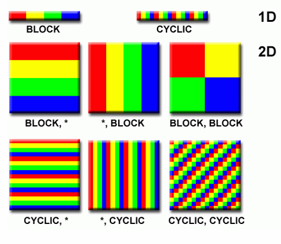
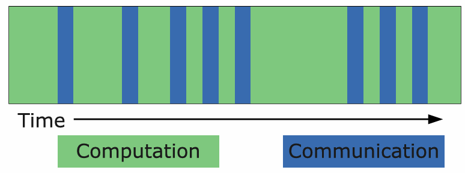
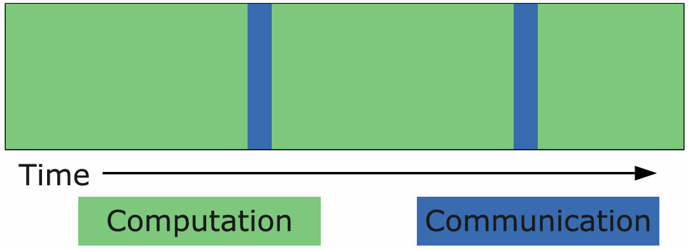

# Designing Parallel Programs

Techniques for designing parallel programs are typically separated between automatic & manual parallelization.

## 1 - Automatic Vs. Manual
Manually designing parallel programs requires programmers to be responsible for 
**identifying and implementing parallelism**, which can be very complex, error-prone,
& iterative. Parallelizing compilers helps for converting serial programs to parallel. They work in two ways: fully
automatic & programmer directed.

### 1.1 - Fully Automatic Parallelization
The source code of the serial program is analyzed by the compiler, which 
- identifies opportunities for parallelism
- identifies inhibitors to parallelism
- analyzes whether parallelism will improve performance
Code in loops are often the target for automatic parallelization.

### 1.2 - Programmer-Directed Parallelization
Using "compiler directives" or possibly compiler flags, the **programmer explicitly tells the compiler how to
parallelize the code**.

### 1.3 - Issues with Automatic Parallelization
- Wrong results
- Performance degradation
- Much less flexible
- Limited to a subset of code (mostly loops)
- May not perform parallelization
- Most for Fortran

## 2 - Understand the Problem
For a non-parallelisable problem, one part of the problem must be dependent on the other part.

Hotpot: the part of the program where the real work is done.

Bottleneck: areas that are disproportionately slow, or cause parallelism work to halt or be deferred (I/O).

It may be possible to restructure the program or use a different algorithm to reduce or eliminate unnecessary slow areas.

Inhibitors: I/P and data dependence (Fibonacci series) is generally considered an inhibitor to parallelism.

## 3 - Partitioning
One of the first steps in designing a parallel program is to **break the problem into discrete "chunks" of work**, known
as decomposition or partitioning. There are two basic ways to partition computational work among parallel tasks:
- domain decomposition
- functional decomposition

### 3.1 - Domain Decomposition
Domain decomposition is based on **breaking up the problem data**. Each parallel task then works on a portion of the data.

### 3.2 - Functional Decomposition
Functional decomposition is **breaking up the problem based on the composition**.
The problem is decomposed according to the work that must be done.

Functional decomposition is suitable for problems that can be split into different tasks (ecosystem modelling, 
signal processing, climate modelling).

## 4 - Communication
### 4.1 - Communication Unnecessary
E.g. Imagine an image processing operation where every pixel in a black and white image needs to have its colour reversed
These types of problems are often called **embarrassingly parallel** because they are so straight-forward.

### 4.2 - Communication Necessary
Most parallel applications are not quite so simple, and do require tasks to shared data with each other.

### 4.3 - Factors to Consider
- Cost of communications: implies overhead
- Latency vs. bandwidth: sending many small messages can cause latency to dominate communication overheads -> package small
messages into a larger one.
- Visibility of communications
- Synchronous vs. asynchronous
  - synchronous communication = blocking communications
  - asynchronous communication = non-blocking communications (e.g. task 1 can prepare and send a message to task 2,
 and then immediately begin doing other work)
- Scope of communications: knowing which tasks must communicate with each other:
  - P2P
  - Collective

    
## 5 - Synchronization
Managing the sequence of work and the tasks performing it is a critical design consideration for most parallel programs.
There are different types of synchronization: barrier, lock/semaphore, synchronous communication operations.

### 5.1 - Barrier
Each task performs its work until it reaches the barrier. It then stops, or "blocks".
When the last task reaches the barrier, all tasks are synchronised.

### 5.2 - Lock/Semaphore
Can solve any number of tasks. Typically, used to serialize (protect) access to global data or a section of code.
**Only one task at a time may use the lock / semaphore / flag.**

Can be blocking or non-blocking.

### 5.3 - Synchronous Communication Operations
Involves only those executing a communication operation. 

When a task performs a communication operation, some form of coordination is required with the other task(s) participating in the communication

## 6 - Data Dependencies
A dependence exists between program statements when the **order of statement execution affects the program results.**

A data dependency is caused by multiple use of the same location in storage by different tasks.

#### How to Handle Data Dependencies
- Distributed memory architectures: communicate required data at synchronization points
- Shared memory architectures: synchronize read/write operations between tasks

## 7 - Load Balancing
Load balancing refers to the practice of distributing approximately equal amounts of work among tasks so that all 
tasks are kept busy all the time.

There are two ways we can use to achieve load balancing:
1. Equally partitioning work
2. Dynamic work assignment

### 7.1 - Partitioning Work
- For problems where each task performs similar work, distributing evenly.
- For loop iterations where the work done in each iteration is similar, evenly distribute the iterations across the tasks.

This will work well for systems where each processor has a similar performance.
Yet, many parallel computing systems are made of computers that have different performance. In this case, distributing
work evenly in terms of the amount of workload may still result in an imbalanced load -> performance analysis tool.

### 7.2 - Problems Unsuitable for Static Partitioning
- Sparse arrays: some tasks will have actual data to work on while others have mostly zeros.
- Adaptive grid methods: some tasks may need to refine their mesh while others don’t.
- N-body simulations: particles may migrate across task domains requiring more work for some tasks

### 7.3 - Dynamic Work Assignment
An implementation to achieve this is the use of a **shared work queue**, which lists all the tasks to be completed.
Worker threads will pull tasks from the queue to do, and when they are done with their current task they can pull another
from the queue.

#### Dynamic Work Assignment Approaches
- Scheduler-task pool approach
- Work sharing
- Work stealing

## 8 - Granularity
### 8.1 - Fine-Grained Parallelism

- Low computation to communication ratio.
- Facilitates load balancing.
- Fine-grained parallelism is often associated with problems that can be divided into many small tasks.
- Work well in architectures which support fast communication

### 8.2 - Coarse-Grained Parallelism

- High computation to communication ratio
- Hard to load balance
- Coarse-grained parallelism is often associated with problems that can be broken down into large tasks.
  - generally meaning that there is less communication and synchronization overhead
- Coarse-grained parallelism can make best use of systems with longer communication times.

### 8.3 - Which is the Best?
Depend on the algorithm & the hardware environment.

## 9 - I/O
### 9.1 - The Bad News
I/O operations are generally considered as inhibitors to parallelism. Parallel I/O might be immature or not available
for all platform.
### 9.2 - The Good News
Parallel file systems are available
- GPFS: General Parellel File System.

## 10 - Limits and Costs of Parallel Programming

### 10.1 - Amdahl's Law
Amdahl's Law states that potential program speedup is defined by the fraction of code (P) that can be parallelized:
$$\frac{1}{1-P}$$

The less of the code that can be parallelism, the less possible speedup we can have.

### 10.2 - Number of Processors

Introducing the number of processors performing the parallel fraction of work, changes the formula:
$$\text{speedup} = \frac{1}{\frac{P}{N} + S}$$
where P is the parallel fraction, S is the serial fraction, N is the number of processors. *Note: `P + S = 1`

- The unachievable best case is for N processors, the speedup would be N.

### 10.3 - Consequences of Amdahl's Law
The amount of code NOT parallelizable is more influential than the percent that is parallelizable.

Scalability is an issue, even for highly parallelizable solutions.

### 10.4 - Comparing Performance and Problem Size
Problems that increase the percentage of parallel time with their size are more scalable than problems with a fixed
percentage of parallel time.

## 11 - Scalability
The ability of a parallel program's performance to scale is a result of a number of interrelated factors.
- Simply adding more machines is rarely the answer.
The algorithm may have inherent limits to scalability:
- At some point, adding more resources causes performance to decrease.

Hardware factors play a significant role in scalability.

