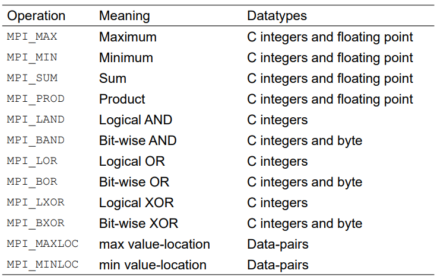

# MPI Collective Communication

## 1 - Barrier Synchronization

The **barrier synchronization** operation is performed in MPI using: `int MPI_Barrier(MPI_Comm comm)`, which causes all
processes to **wait at the barrier until the last process arrives**. After this, all processors are released and proceed
again. This happens automatically.

## 2 - MPI_Bcast

The one-to-all broadcast operation is:

``` 
int MPI_Bcast(void* buf, int count, MPI_Datatype, int source, MPI_Comm comm);
```

This operation sends a message from one process to all the others.


### 2 - MPI_Reduce
The MPI_Reduce function is an all-to-one broadcast operation:

``` 
int MPI_Reduce(void* sendbuf, void* recvbuf, int count, MPI_Datatype datatype, MPI_Op op, int target, MPI_Comm comm );
```

This operation **sends a message from all processes to one process** (including from the receiver to itself).

It also **performs an operation** on the data that is sent.

### Predefined Reduction Operations


## 3 - MPI_Allreduce
If the result of the reduction operation is needed by all 
processes, MPI provides the Allreduce operation:
``` 
int MPI_Allreduce(void *sendbuf, void *recvbuf, int count, 
MPI_Datatype datatype, MPI_Op op, MPI_Comm comm)
```

## 4 - MPI_Scatter
Naturally, we may want different processes to deal with different tasks, where we can use `MPI_Scatter`.

``` 
int MPI_Scatter(void *sendbuf, int sendcount, 
MPI_Datatype senddatatype, void *recvbuf, int recvcount, MPI_Datatype recvdatatype, int source, MPI_Comm comm) 
```
Scatter differs from broadcast in that different chunks of 
the send buffer is sent to each receiver (broadcast sends the same message).


